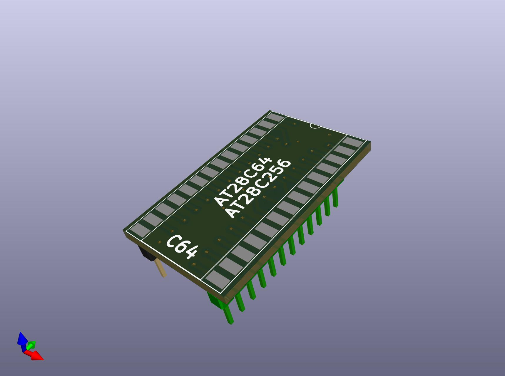
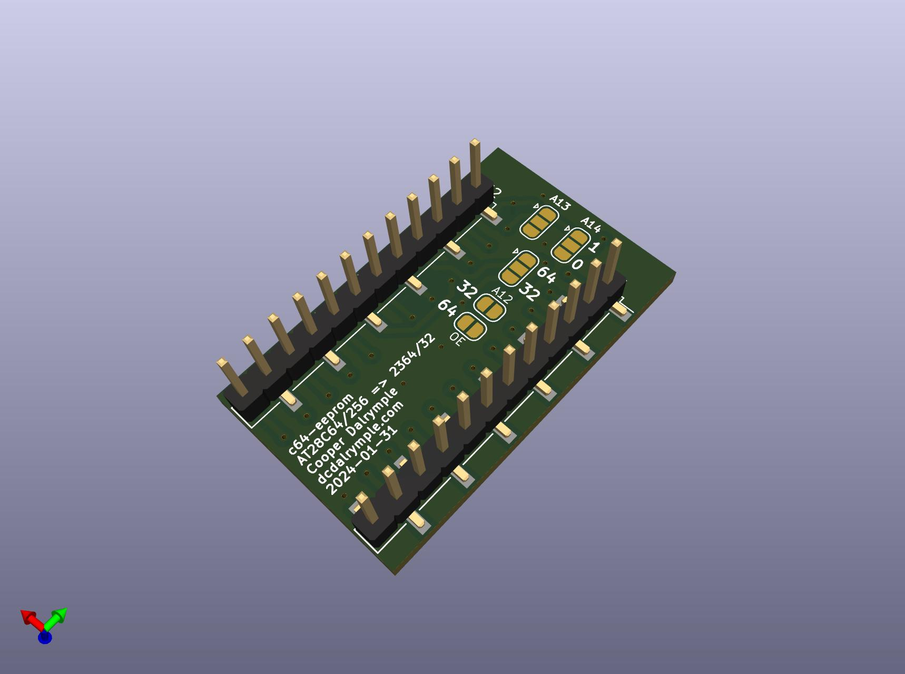

# C64-EEPROM

Use standard 0.6" DIP EEPROMs in place of a mask rom footprints. Compatible with various mask roms and EEPROMS with solder jumper configuration.

| Top                                       | Bottom                                          |
| ----------------------------------------- | ----------------------------------------------- |
|  |  |

## Compatible ROM ICs

Use the following tables to determine the necessary solder jumper configuration.

### EEPROMs

| EEPROM      | Configuration                                                                                             |
| ----------- | --------------------------------------------------------------------------------------------------------- |
| AT28C64(B)  | A13 and A14 jumpers can be left unconfigured (NC).                                                        |
| AT28C256    | A13 and A14 jumpers can be configured to select 1 of 4 banks. Leave both as "0" (GND) to use first 4/8KB. |

> It is possible to connect switches to the A13 and A14 solder jumper pads to enable quick bank switching with an AT28C256 to select between 4 ROM images. To minimize size and materials, this board does not include this feature by default.

### Mask ROMs

| Mask ROM    | Typical Usage                                   | Configuration                                                                                 |
| ----------- | ----------------------------------------------- | --------------------------------------------------------------------------------------------- |
| 2364        | C64 Kernal (901227-03) & BASIC (901226-01) ROMs | Solder pad 2 (middle) to pad 1 (arrow) of the 64/32 jumper (the 64 side) and the OE jumper.   |
| 2332        | C64 Character ROM (901225-01)                   | Solder pad 2 (middle) to pad 3 (bottom) of the 64/32 jumper (the 32 side) and the A12 jumper. |

## Materials

This board uses 2 SMD 0.1" pitch pin headers and 1 0.6" wide, 0.1" pitch SMD DIP socket. SMD components were selected to reduce board width. However, standard through hole components can be easily modified to be SMD compatible by bending the socket legs outward and the pin header legs left and right alternating outward.

No other components are necessary as the AT28C64/256 EEPROMS are 5V-compatible and otherwise identical to standard mask roms. Using this board without an IC socket for the EEPROM is possible, but not recommended.

## Programming

EEPROMs are fairly simple and easy to program. They can be programmed using a standard TL866 programmer or any other compatible ROM programmer. A number of other solutions also exist which don't require specialized equipment. Here are a few options using off-the-shelf components:

- [PicoPROM](https://github.com/gfoot/picoprom)
- [32u4-programmer](https://github.com/dcooperdalrymple/32u4-programmer) (a little bit of self-promotion here)
- [Arduino EEPROM programmer](https://github.com/beneater/eeprom-programmer)
- [eeprom-writer](https://github.com/oddblk/eeprom-writer)
- [TommyPROM](https://tomnisbet.github.io/TommyPROM/)
